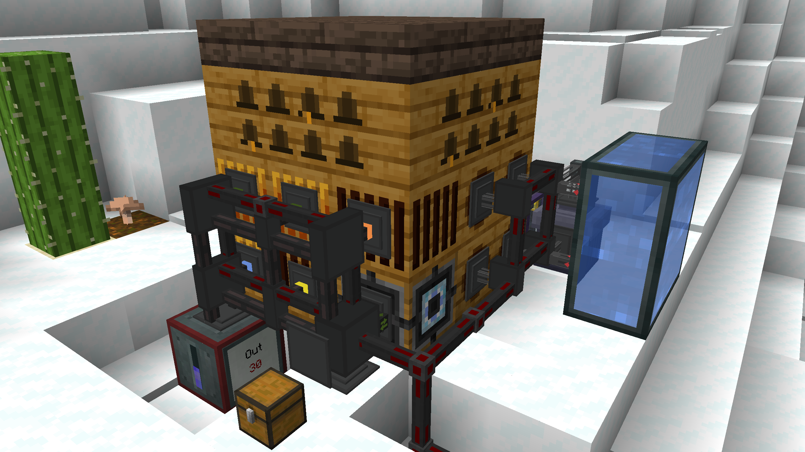
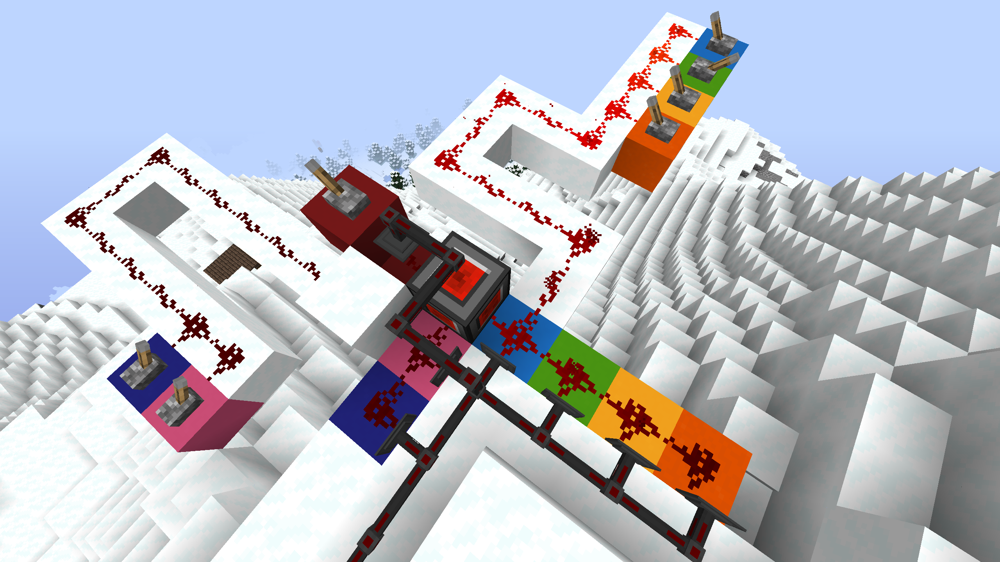
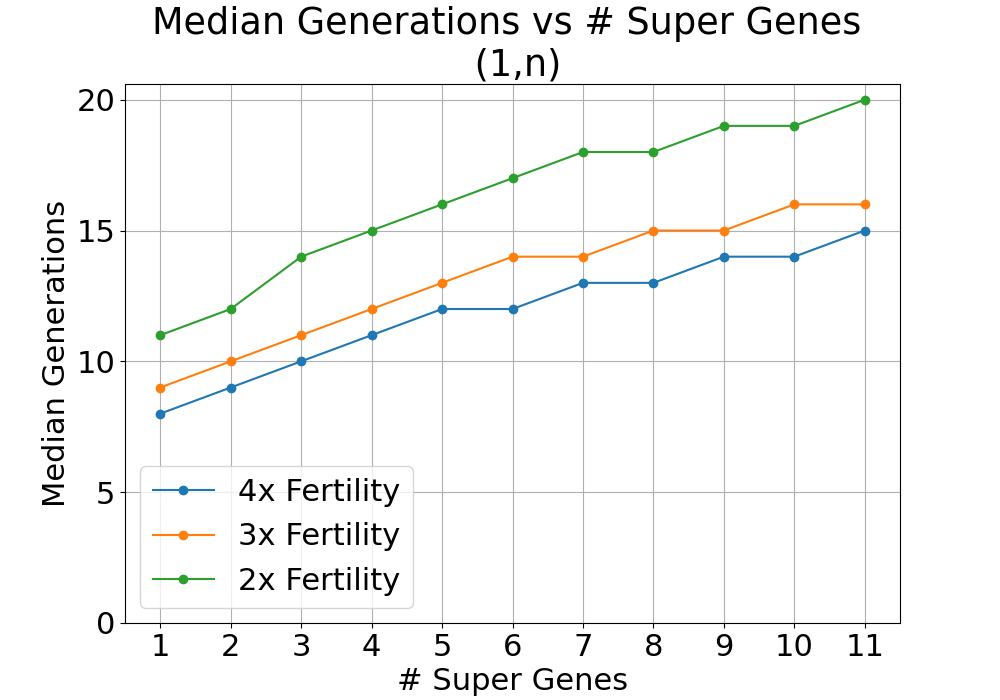
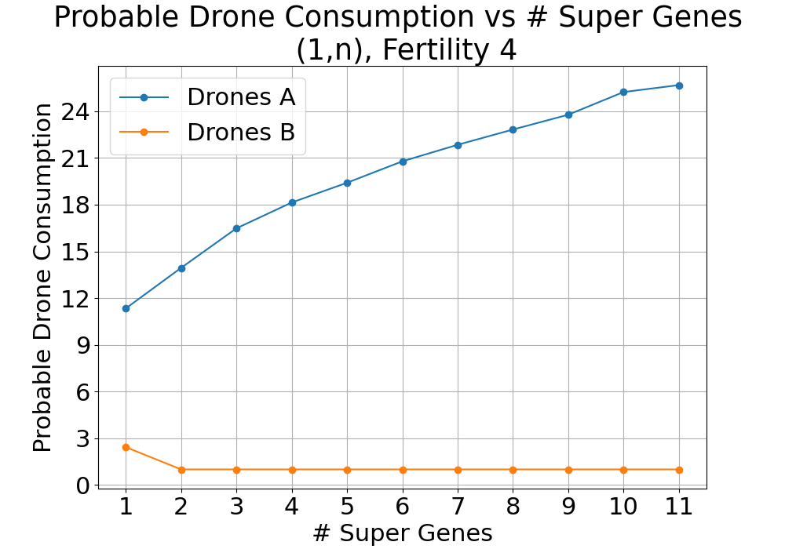
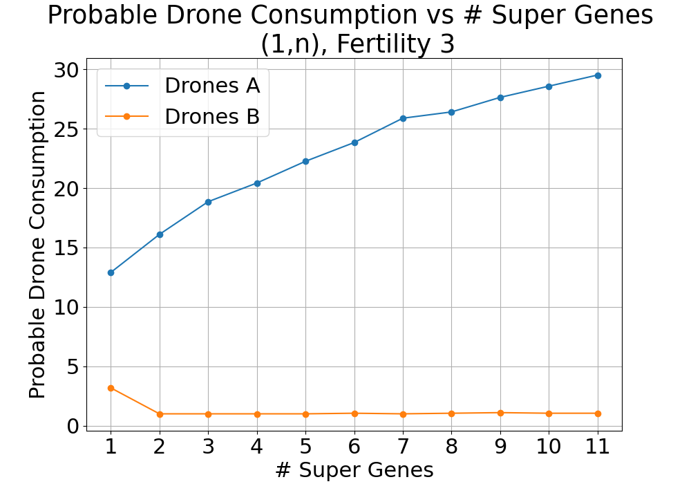
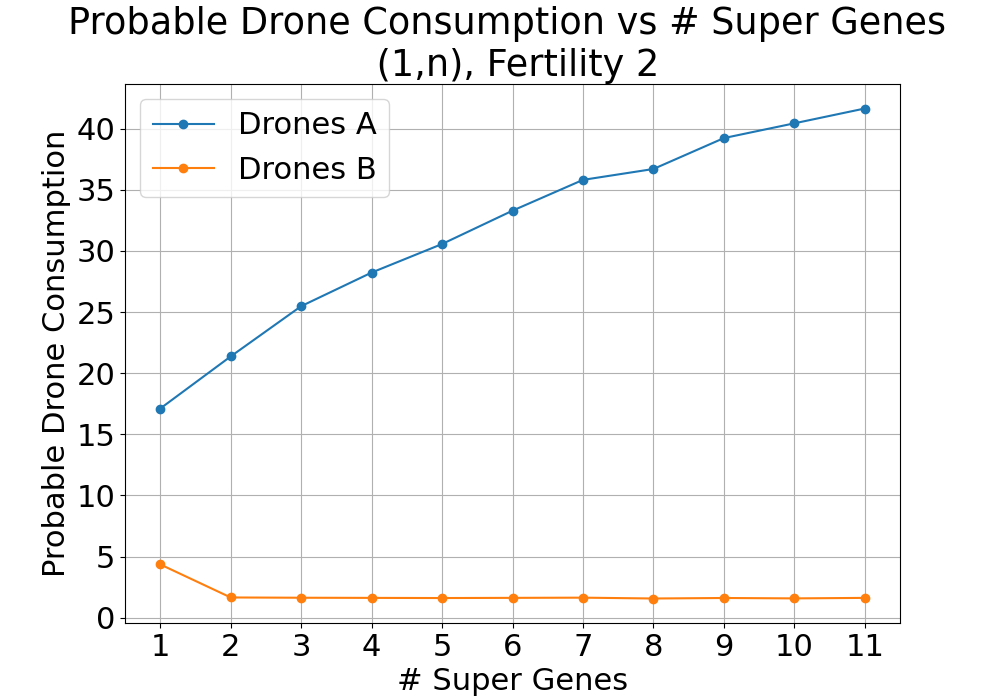
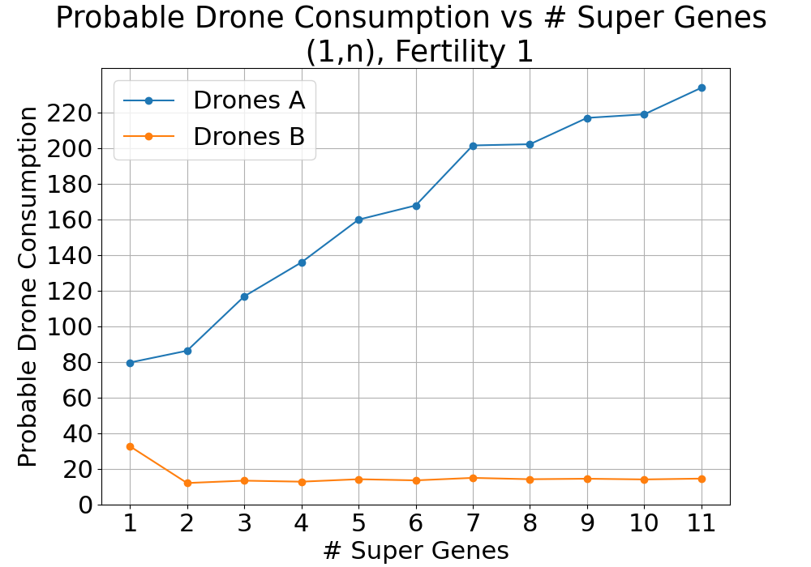

Welcome to the 
# Automated Bee Breeding Guide
Chapters:
1. Universal Climate Control
2. Trait Breeding Program
3. Mutation
4. New Species Program

## Chapter 1: Universal Climate Control
Forestry uses Percent (%) units, but they are all additive!
|Temperature|Icy|Cold  |Normal |Warm    |Hot  |
|-----------|---|------|-------|--------|-----|
|% Range    |T<0|0<T<35|35<T<85|85<T<100|T>100|

|Humidity   |Arid|Normal |Damp|
|-----------|----|-------|----|
|% Range    |H<30|30<H<85|H>85|

There are three strategies for making bees feel comfortable in their home. You could find (or create) the correct biome, use the acclimitizer to give them high tolerances, or use the climate blocks in the Alveary (Fan, Heater, Hygroregulator).
For scenarios that involve more than one species (trait breeding & mutating), relying only on biomes for climate control is impractical. You would have to change location every time the bee's active species switches. The acclimitizer can be useful, but also expensive in items to run (wax capsules, sand, snow, lava/blaze). We recommend using alveary climate controls, with the setup below:

The alveary climate blocks have the following effects:
|Block/Fluid|Temperature|Humidity|
|-----------|-----------|--------|
|Heater     |       +28%|       -|
|Fan        |       -19%|       -|
|Water      |        -1%|    +19%|
|Lava       |        +1%|    -19%|

Since increasing climate stats is easier than decreasing them, and water is cheaper than lava, we recommend to build in an Icy & Arid biome (T=0,H=10) (eg Glacier, Ice River, Ice Ocean, Snow Forest, Snow Desert).

The y level also has to be considered to make sure you can reach the temperature range Warm with only heaters. Some starting temperatures switch from Normal to Hot, skipping Warm, when adding heaters.

$85 < T+28*4 < 100$

$\implies -27<T<-12$

$Temp \approx BiomeTemp - (y-61)/6.15$

$\implies 230>y>140$

Building between these y values makes sure you can reach Warm with 4 heaters. To leave room for Temperature fluctuations from hygroregulators and rounding, aim somewhere between y=170 and y=200. The climate control table can look something like this:

|y=180   |0 Water|2 Water|4 Water||
|--------|------:|------:|------:|-:|
|0 Heater|-19, 10|  0, 48|  0, 86|Icy
|1 Heater|  8, 10|  7, 48|  5, 86|Cold
|2 Heater| 37, 10| 35, 48| 33, 86|
|3 Heater| 65, 10| 64, 48| 62, 86|Normal
|4 Heater| 94, 10| 92, 48| 90, 86|Warm
|5 Heater|122, 10|121, 48|119, 86|Hot
|        |   Arid| Normal|   Damp|

With a redstone power level input panel, we can sucessivly toggle the energy conduits for the heaters and the pressurized fluid conduits for the water.
To also support nether bees, add an electrical stimulator with a basic circuit board with one blazing electron tube.
To automatically control the daylight, build a block swapper with and alveary lighting and unlighting. The lighting is needed at night for diurnal bees, and the unlighting during day for nocturnal bees. Use a daylight sensor to toggle the block swapper (untested). Or build the setup in a personal dimension without day/night cycle and only use the unlighting.

## Chapter 2: Trait Breeding Program

The trait breeding program transfers traits (genes) from one bee to another. These traits can be any independent genome, including species, production speed, lifespan and others. Only climate is dependent on the species and cannot be changed independently. We refer to the colony that donates more traits as the super bee.

### How to run the program
Put some drones from each colony into the input drawer, and any princess (preferably pristine, species and traits don't matter) into the storage chest. Start the program "beeBreeding". The program asks which trait you would like to have for each trait that is not the same. Type 'A' or 'B' to select them, or hit just enter to ingore that trait. Ingoring a trait can result in the princess & drone having a mix of both traits, but simply inbreeding the result should eventually flip into either one and make all drones stack again. The programm should start automatically after questioning.

### How many generations will the program take?
There is no upper limit on how many generations the program will take. You can always get unlucky and not make breeding progress. But with high fertility and the right settings, the program typically needs 10-40 generations. Simulation results can be found in results3.txt.

#### Median Generation Count for 1 non-super trait, n super-traits, depending on Fertility

Our current algorithm is optimized for choosing many traits from one (super) bee colony and few traits from the other colony. Transferring one non-super trait at a time can take fewer generations than transferring multiple at once, although this is more manual work. For example, lets say you have a super bee with 8 good traits, and a new species with 2 good ones. You could run the program as 2+8=10 traits (median 36 generations), or you could first run 1+8=9 traits and then 1+9=10 traits (median 13 + 14 = 27 generations). To do this, select ignore for one of the 2 traits. Then multiply the 9 trait drone a few times, and use it again in the input drawer. We have a concept for an algorithm that would be faster in combining many with many traits, but it is not yet implemented.

### How many drones should you provide?
You will need more of the drones you want to take more traits from. When taking exactly one trait from the other drones, use at least as many drones as shown in the plots below. If you take more In summary, unless when dealing with Fertility 1, using 50+ super drones and 5+ of the others will be enough.

#### Expected Drone consuptions for 1 non-super trait, n super-traits, depending on Fertility, 99% Percentile
|||
|-|-|
|||
|||
