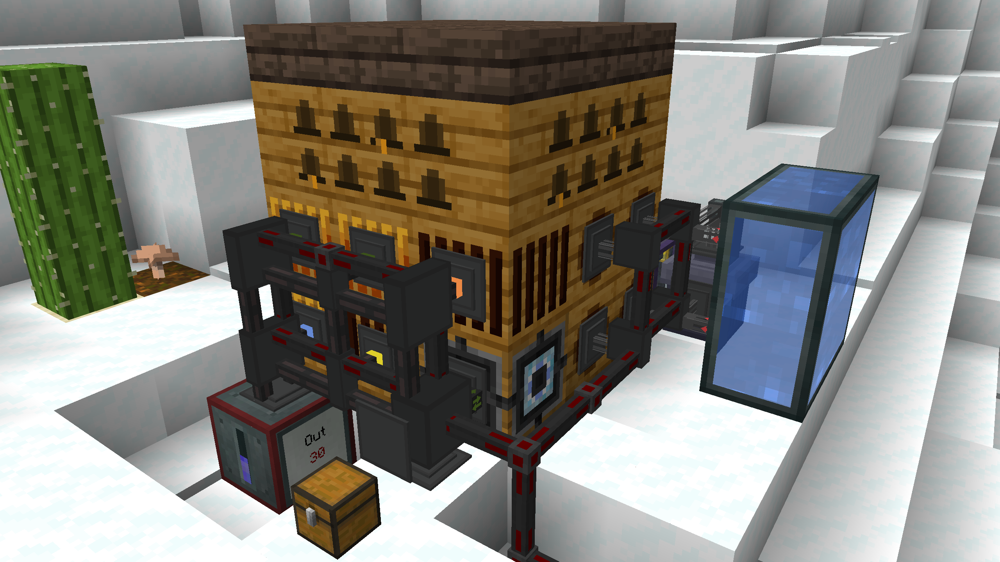
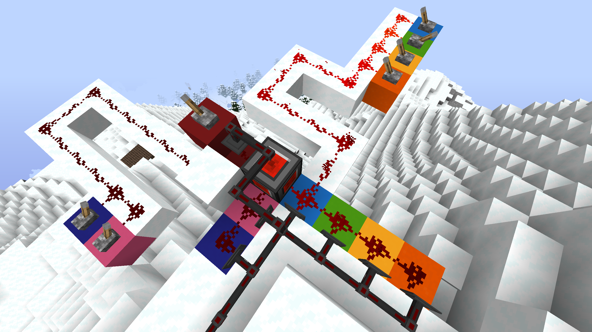

Welcome to the 
# Automated Bee Breeding Guide
Chapters:
1. Universal Climate Control
2. Stat Breeding Program
3. Mutation
4. New Species Program

## Chapter 1: Universal Climate Control
Forestry uses Percent (%) units, but they are all additive!
|Temperature|Icy|Cold  |Normal |Warm    |Hot  |
|-----------|---|------|-------|--------|-----|
|% Range    |T<0|0<T<35|35<T<85|85<T<100|T>100|

|Humidity   |Arid|Normal |Damp|
|-----------|----|-------|----|
|% Range    |H<30|30<H<85|H>85|

There are three strategies for making bees feel comfortable in their home. You could find (or create) the correct biome, use the acclimitizer to give them high tolerances, or use the climate blocks in the Alveary (Fan, Heater, Hygroregulator).
For scenarios that involve more than one species (stat breeding & mutating), relying only on biomes for climate control is impractical. You would have to change location every time the bee's active species switches. The acclimitizer can be useful, but also expensive in items to run (wax capsules, sand, snow, lava/blaze). We recommend using alveary climate controls, with the setup below:

The alveary climate blocks have the following effects:
|Block/Fluid|Temperature|Humidity|
|-----------|-----------|--------|
|Heater     |       +28%|       -|
|Fan        |       -19%|       -|
|Water      |        -1%|    +19%|
|Lava       |        +1%|    -19%|

Since increasing climate stats is easier than decreasing them, and water is cheaper than lava, we recommend to build in an Icy & Arid biome (T=0,H=10) (eg Glacier, Ice River, Ice Ocean, Snow Forest, Snow Desert).

The y level also has to be considered to make sure you can reach the temperature range Warm with only heaters. Some starting temperatures switch from Normal to Hot, skipping Warm, when adding heaters.

$85 < T+28*4 < 100$

$\implies -27<T<-12$

$Temp \approx BiomeTemp - (y-61)/6.15$

$\implies 230>y>140$

Building between these y values makes sure you can reach Warm with 4 heaters. To leave room for Temperature fluctuations from hygroregulators and rounding, aim somewhere between y=170 and y=200. The climate control table can look something like this:

|y=180   |0 Water|2 Water|4 Water||
|--------|------:|------:|------:|-:|
|0 Heater|-19, 10|  0, 48|  0, 86|Icy
|1 Heater|  8, 10|  7, 48|  5, 86|Cold
|2 Heater| 37, 10| 35, 48| 33, 86|
|3 Heater| 65, 10| 64, 48| 62, 86|Normal
|4 Heater| 94, 10| 92, 48| 90, 86|Warm
|5 Heater|122, 10|121, 48|119, 86|Hot
|        |   Arid| Normal|   Damp|

With a redstone power level input panel, we can sucessivly toggle the energy conduits for the heaters and the pressurized fluid conduits for the water.
To also support nether bees, add an electrical stimulator with a basic circuit board with one blazing electron tube.
To automatically control the daylight, build a block swapper with and alveary lighting and unlighting. The lighting is needed at night for diurnal bees, and the unlighting during day for nocturnal bees. Use a daylight sensor to toggle the block swapper (untested). Or build the setup in a personal dimension without day/night cycle and only use the unlighting.

## Chapter 2: Stat Breeding Program
